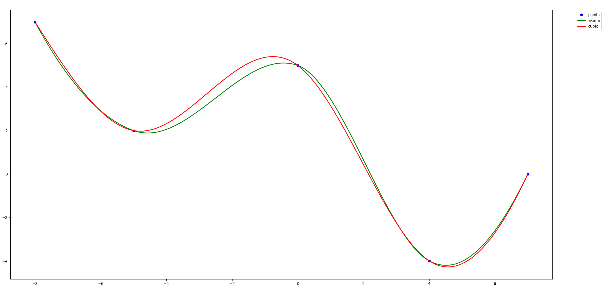

# Splines
Simple **C library** for calculating 2 kind of splines ([Akima](https://en.wikipedia.org/wiki/Akima_spline), [Cubic](https://en.wikiversity.org/wiki/Cubic_Spline_Interpolation))

For visualisation was used [Python](https://www.python.org/) and [matplotlib](https://matplotlib.org/) library.

To compile the library, sample application, and run plot-script - just run **run.sh**

